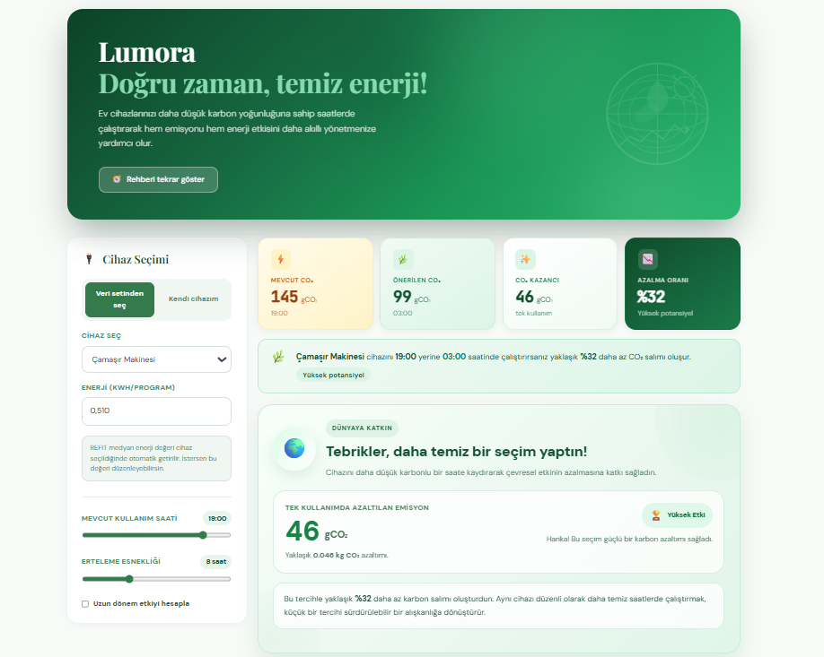

<p align="center">

# LUMORA
</p>

Lumora, elektrik kullanımını azaltmadan **enerjiyi doğru zamanda kullanarak karbon emisyonunu azaltmayı hedefleyen** karbon odaklı bir enerji optimizasyon platformudur.

Elektrik üretiminin karbon yoğunluğu gün boyunca değişmektedir.  
Lumora bu değişimi analiz ederek ev cihazlarının **daha düşük karbon yoğunluğuna sahip saatlerde çalıştırılmasını önerir**.

Bu sayede kullanıcılar aynı enerjiyi kullanmaya devam ederken **karbon ayak izlerini azaltabilirler.**



---

# 🌱 Vizyon

Enerji tüketimini tamamen durduramayız.

Ancak enerjiyi **doğru zamanda kullanarak** karbon emisyonunu önemli ölçüde azaltabiliriz.

Lumora'nın vizyonu karbon farkındalıklı enerji kullanımını günlük hayatın bir parçası haline getirmektir.

---

# 🌍 Canlı Demo

Projeyi doğrudan aşağıdaki bağlantıdan deneyebilirsiniz.

**Live Demo**  
https://lumora-energy.netlify.app/

---

# 🎤 Proje Sunumu

Hackathon kapsamında hazırladığımız proje sunumuna aşağıdaki bağlantıdan ulaşabilirsiniz.


Drive linki:
https://docs.google.com/document/d/1apzMuZLylvERG_yi_Ju-rmM0WPQ22ANbtQJUIwKOseE/edit?usp=sharing

Prezi linki:
https://prezi.com/view/JQ0CPhOMy2v15W6o6g5d/?referral_token=ClMZdalnB3FN

---

# 🚀 Temel Özellikler

- cihaz seçimi
- enerji tüketimi girişi
- karbon yoğunluğu analizi
- önerilen çalışma zamanı
- CO₂ tasarruf hesaplama
- kullanıcı dostu dashboard

---

# 🧠 Kullanılan Teknolojiler

### Frontend
- React
- Vite
- TailwindCSS

### Veri Analizi
- Python
- Jupyter Notebook

### Deployment
- Netlify

---

## 📊 Veri Kaynakları

- **REFIT Dataset**  
https://www.kaggle.com/datasets/kyleahmurphy/uk-electrical-load

- **Ember Climate Data**  
  https://ember-climate.org/data/

---

# 💻 Projeyi Lokal Olarak Çalıştırma

Projeyi kendi bilgisayarınızda çalıştırmak için aşağıdaki adımları izleyebilirsiniz.

```bash
git clone https://github.com/zuleyha04/binary-minds-lumora-carbon-aware-energy.git
cd binary-minds-lumora-carbon-aware-energy
npm install
npm run dev
Ardından terminalde gösterilen local adresini tarayıcıda açın.
Genellikle:

http://localhost:5173/

---

binary-minds-lumora-carbon-aware-energy
│
├── images
│   ├── lumora.png
│   └── lumora_sunum.png
│
├── notebooks
│   ├── co2_calculation.ipynb
│   └── data_analysis.ipynb
│
├── public
│   └── data
│
├── src
│   ├── components
│   └── utils
│
├── index.html
├── package.json
└── README.md

---
```

## 👥 Takım

**Binary Minds**

- [Züleyha Akbaş](https://github.com/zuleyha04)
- [Gizem Efe](https://github.com/gizembm)

---
